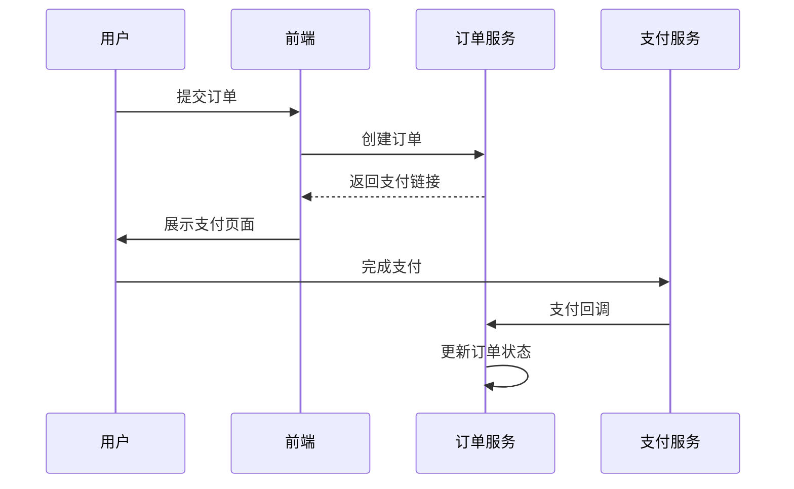
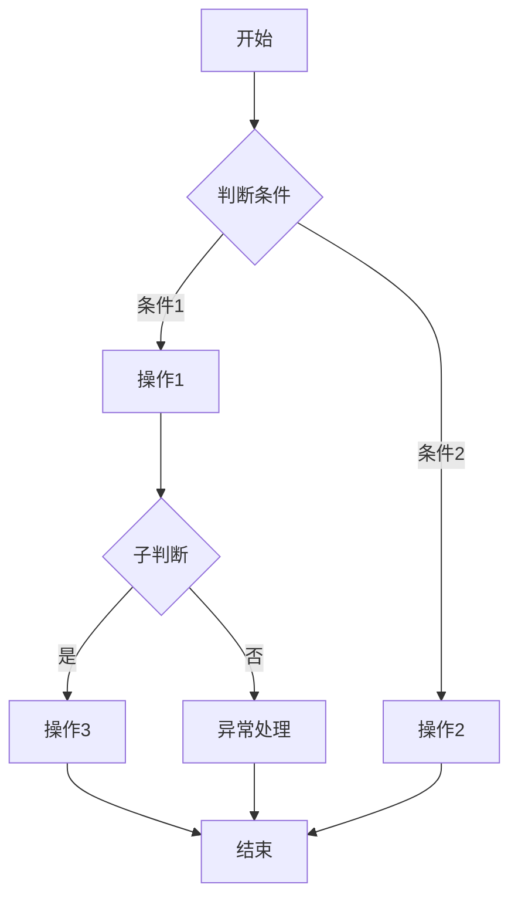
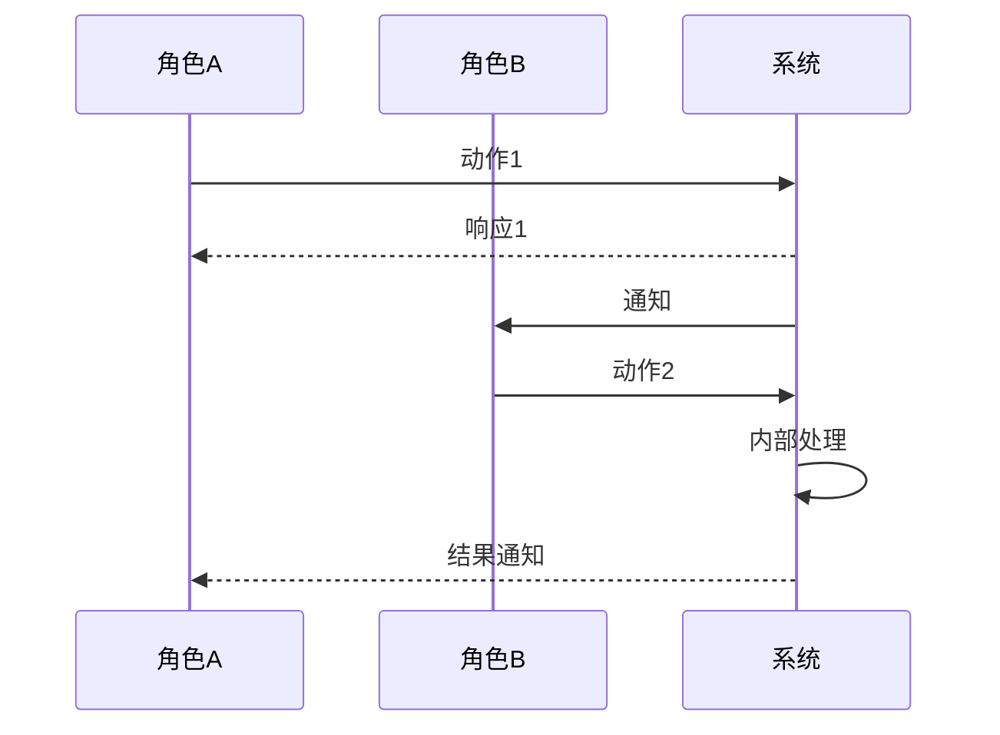
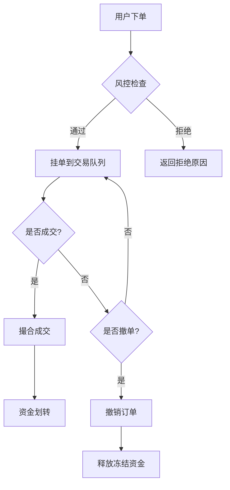

# 业务流程建模

## 一、适用场景

- **新业务流程设计**：从零搭建业务流程时，用建模方法定义完整路径
- **现有流程梳理与优化**：对已有业务流程进行结构化梳理，识别冗余节点和优化机会
- **系统工作流映射**：将业务逻辑转化为系统可执行的工作流定义
- **识别流程瓶颈/断点**：定位流程中的效率瓶颈、等待环节、信息断裂点
- **跨角色/跨系统流程对齐**：多部门、多系统协作时统一流程语言，消除歧义

## 二、核心模型

### 2.1 业务流程三要素

```
角色（Who）→ 节点（What）→ 状态（Where）
```

- **角色**：谁在执行？用户/运营/系统/第三方
- **节点**：做了什么？任务/判断/等待/并行
- **状态**：处在哪个阶段？订单状态、工单状态、审核状态

任何业务流程都可分解为这三个维度的组合。

### 2.2 流程建模符号

| 元素 | 符号表示 | 含义 | 使用注意 |
|------|---------|------|---------|
| 开始/结束 | 圆角矩形 | 流程的起止点 | 每个流程有且仅有一个开始节点 |
| 任务/操作 | 矩形 | 一个具体的操作步骤 | 保持粒度一致，避免过粗或过细 |
| 判断/分支 | 菱形 | 条件决策点（是/否 / 多分支） | 明确所有分支条件，不要遗漏"else" |
| 流向 | 箭头 | 节点之间的流转方向 | 避免交叉线过多，使用泳道降复杂 |
| 泳道 | 横向/纵向分割 | 按角色/系统划分责任区域 | 明确边界，避免模糊归属 |
| 并行 | 双横线 | 可同时进行的多个任务 | 标注汇合条件，避免死锁 |
| 异常/超时 | 闪电 ⚡ | 超时、失败、回滚等异常路径 | 每个正常路径都应配一条异常路径 |
| 子流程 | 带双竖边的矩形 | 可展开为独立流程图的子流程 | 子流程应有独立入口和出口 |

### 2.3 状态机模型

```
每个业务实体都有一个生命周期：

         ┌────────────────┐
         │    节点1       │
         └───────┬────────┘
                 │
          ┌──────┴──────┐
          │  条件1      │
          └──────┬──────┘
                 │
         ┌───────▼────────┐
         │    节点2       │
         └───────┬────────┘
                 │
          ┌──────┴──────┐
          │  条件2      │   条件3
          └──────┬──────┘    │
                 │           │
         ┌───────▼────────┐ ┌▼───────────┐
         │    节点3       │ │ 节点4(异常)│
         └────────────────┘ └────────────┘
```

**核心原则**：
1. 每个状态转换必须有明确的**触发事件**（用户操作/系统回调/超时）
2. 每个状态转换必须带**条件约束**（满足条件才能转换）
3. **异常状态**必须从正常状态可达（而不是凭空跳入异常）

### 2.4 三种建模视角

| 视角 | 关注点 | 产出物 | 使用者 |
|------|--------|--------|--------|
| **业务视角** | 角色、目标、业务规则 | 泳道图 + 业务规则表 | 产品经理、业务方 |
| **系统视角** | 实体、状态、事件、接口 | 状态机图 + 事件表 | 架构师、开发者 |
| **数据视角** | 数据流向、数据结构变化 | 数据流图 + CRUD矩阵 | 数据分析师、后端开发 |

## 三、设计步骤（SOP）

### Step 1：识别核心业务实体

确定流程围绕哪些核心实体展开。

**作业**：列出所有业务实体及其定义

```yaml
实体清单:
  - 名称: 订单
    定义: 用户发起的一笔交易记录
  - 名称: 支付记录
    定义: 与订单关联的支付流水
  - 名称: 退款单
    定义: 订单退款时创建的退款工单
```

### Step 2：画出实体生命周期

为每个核心实体画出完整的状态转换图。

**作业**：画出状态机，标注所有合法转换

```
订单: 已创建 → 待支付 → 已支付 → 已确认 → 已发货 → 已签收 → 已完成
           ↓                            ↓
         已取消                      退货中 → 已退款 → 已完成
```

### Step 3：标识各状态的触发条件

明确谁触发、在什么条件下触发状态转换。

**作业**：填写触发条件表

| 当前状态 | 触发事件 | 触发角色 | 前置条件 | 下一状态 |
|----------|---------|---------|---------|---------|
| 待支付 | 支付成功回调 | 支付网关 | 支付金额=订单金额 | 已支付 |
| 待支付 | 用户取消 | 用户 | 订单未超时 | 已取消 |
| 待支付 | 支付超时 | 系统定时器 | 超过30分钟未支付 | 已取消 |

### Step 4：画出跨角色泳道图

用泳道清晰划分各角色/系统的职责边界。

**作业**：泳道图 + 角色职责表



### Step 5：识别异常路径

关键点：每条正常路径都应有对应的异常处理路径。

**异常路径清单模板**：

| 异常节点 | 异常类型 | 触发条件 | 处理方式 | 恢复策略 |
|----------|---------|---------|---------|---------|
| 支付环节 | 超时 | 30分钟未支付 | 自动取消订单 | 用户可重新下单 |
| 支付环节 | 支付失败 | 余额不足/风控拒绝 | 提示用户更换支付方式 | 重试支付 |
| 发货环节 | 库存不足 | 实际库存<订单数量 | 进入缺货待补流程 | 补货后自动发货 |
| 签收环节 | 退货 | 用户发起退货 | 进入退货审批流程 | 退款后订单终止 |

### Step 6：补充业务规则

约束条件和业务校验逻辑。

**业务规则表模板**：

| 规则编号 | 规则描述 | 触发时机 | 违反处理 |
|---------|---------|---------|---------|
| R01 | 同一订单不可重复支付 | 支付回调到达时 | 拒绝重复回调，返回错误码 |
| R02 | 已发货订单不可取消 | 用户发起取消时 | 拦截请求，引导联系客服 |
| R03 | 退款金额不可超过实付金额 | 退款发起时 | 拒绝退款申请 |

### Step 7：验证流程完整性

完整性检查清单：

- [ ] 每个状态是否有合法入口？
- [ ] 每个状态是否有合法出口？（终止态除外）
- [ ] 是否有不可达的状态？
- [ ] 是否有死循环路径？（有 → 需标注最大循环次数）
- [ ] 异常路径是否都覆盖了？
- [ ] 前置条件是否都明确？
- [ ] 边界条件是否处理了？（空数据、重复请求、并发冲突）

## 四、标准模板

### 4.1 状态机模板

```
实体: [名称]
状态: [待处理] → [处理中] → [已完成]
                    ↓               ↓
                 [异常]          [已归档]

触发条件表:
| 当前状态 | 事件 | 触发角色 | 前置条件 | 下一状态 |
|----------|------|---------|---------|----------|
| [状态A] | [事件名] | [角色] | [条件] | [状态B] |
| [状态B] | [事件名] | [角色] | [条件] | [状态C] |
```

### 4.2 Mermaid 流程图代码



### 4.3 泳道图模板（Mermaid）



### 4.4 流程设计文档模板

```yaml
流程名称: [名称]
版本: v1.0
创建人: [姓名]
创建日期: [日期]

涉及角色:
  - [角色1]: [职责描述]
  - [角色2]: [职责描述]

核心实体:
  - [实体1]: [定义]
  - [实体2]: [定义]

正常路径:
  1. [步骤1]
  2. [步骤2]
  3. [步骤3]

异常路径:
  - [异常1]: [处理方式]
  - [异常2]: [处理方式]

业务规则:
  - [规则1]
  - [规则2]
```

## 五、可复用案例

### 案例1：订单流程

**生命周期**：
```
创建 → 支付 → 确认 → 发货 → 签收 → 完成
  ↓      ↓                     ↓
取消   支付失败             退货 → 退款 → 完成
```

**关键判断节点**：
1. **支付判断**：支付成功 → 确认 | 支付失败 → 重试/更换方式 | 超时 → 自动取消
2. **库存判断**：有货 → 发货 | 缺货 → 转预售/通知到货
3. **签收判断**：满意 → 完成 | 不满意 → 退货入口

**异常路径**：
- 支付超时：30分钟 → 自动取消 → 释放库存
- 支付重复：拒绝第二笔 → 返回支付错误
- 发货失败：物流退回 → 人工处理 → 退款
- 退货争议：平台介入 → 判定 → 补偿/退款

### 案例2：提现流程

**生命周期**：
```
提交 → 初审 → 复审 → 到账
          ↓
       驳回 → 退回（修改后可重新提交）
```

**关键判断节点**：
1. **初审判断**：资料完整 → 复审 | 资料不全 → 驳回
2. **复审判断**：符合规则 → 打款 | 风控触发 → 驳回/人工审核
3. **到账确认**：银行回执确认 → 完成 | 超时未回执 → 人工核查

**异常路径**：
- 银行处理超时：24小时 → 触发人工核查 → 手动确认/重发
- 账户信息错误：打款失败 → 退回 → 修改账户信息 → 重新打款
- 风控拦截：大额提现 → 增强验证 → 延长审核时间

**业务规则**：
- R01：单日提现上限 ¥50,000
- R02：提现手续费 ≥ 提现金额 1%
- R03：新注册用户 7 天内不可提现
- R04：同一银行卡单日提现 ≤ 3 次

### 案例3：KYC 实名认证流程

**生命周期**：
```
提交资料 → 系统初审 → 人工复审 → 通过
              ↓            ↓
            驳回        拒绝（永久/临时）
```

**泳道分工**：

| 角色 | 职责 | 系统边界 |
|------|------|---------|
| 用户 | 提交身份证+人脸识别 | 前端页面 |
| 系统 | OCR识别、活体检测、信息比对 | 风控系统 |
| 审核员 | 疑似资料人工复核 | 审核后台 |

**异常路径**：
- OCR识别失败：图片模糊 → 提示重新拍摄
- 活体检测失败：光线不足/遮挡 → 提示调整环境
- 信息不一致：姓名与身份证号不匹配 → 提示修改 → 3 次限制 → 24h 冷却

### 案例4：交易委托流程

**生命周期**：
```
下单 → 风控检查 → 挂单 → 成交/撤单
          ↓
        拒绝
```

**关键节点**：
1. **风控检查**：检查用户风控等级、账户余额、限价范围
2. **挂单**：进入交易队列，等待撮合
3. **成交**：价格到达 → 自动撮合 → 资金划转
4. **撤单**：未成交部分 → 用户主动撤销 / 收盘自动撤销

**异常路径**：
- 风控拒绝：风控等级不足 → 提示升级认证
- 余额不足：可用余额 < 下单金额 → 拒绝下单
- 价格异常：偏离市场价 > X% → 拒绝或人工复核

**Mermaid 代码**：


---

> **建模检查清单**：每次完成业务流程建模后，对照以下清单自查
>
> ☐ 所有角色已识别，职责边界清晰
> ☐ 所有正常路径节点已覆盖
> ☐ 每个判断节点都有完整的条件分支
> ☐ 异常路径已穷举（超时/拒绝/失败/回滚/中断）
> ☐ 前置条件和业务规则已记录
> ☐ 状态转换有明确的触发事件
> ☐ 没有不可达状态或死循环路径
> ☐ 边界情况已处理（并发/重复/空数据）
