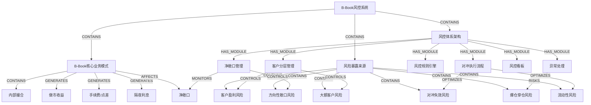

# B-Book 风控系统知识图谱

> B-Book（做市商）模式下经纪商作为客户交易对手方，风控核心是控制净敞口。本图谱覆盖**业务模式**、**风险暴露来源**、**风控体系**（客户分层/净敞口/规则引擎/对冲执行/看板/异常处理）三大域，共 46 个节点和 63 条关系。

## 图谱结构

以下 Mermaid 流程图展示 Level 0 → Level 1 → Level 2 的核心节点与关系（共 21 个节点，27 条边）：

## 节点清单

| ID | 标签 | 类型 | 层级 | 说明 |
|---|---|---|---|---|
| b_book_risk_system | B-Book 风控系统 | Concept | 0 | B-Book做市模式下经纪商风控体系的完整知识图谱 |
| b_book_business_model | B-Book 核心业务模式 | Concept | 1 | 经纪商内部撮合，不抛单至外部流动性提供商 |
| risk_control_architecture | 风控体系架构 | Module | 1 | 风控核心模块与流程的完整架构 |
| risk_exposure_sources | 风险暴露来源 | Risk | 1 | 经纪商面临的主要风险类型 |
| client_profit_risk | 客户盈利风险 | Risk | 2 | 盈利客户过多时经纪商亏损 |
| client_tier_management | 客户分层管理 | Module | 2 | 按客户类型分层，匹配不同风控策略 |
| directional_exposure_risk | 方向性敞口风险 | Risk | 2 | 客户整体看多时经纪商被动做空 |
| exception_handling | 异常处理 | Process | 2 | 各类异常场景的应急处理流程 |
| fee_spread_revenue | 手续费/点差 | Metric | 2 | 每笔交易收取的手续费或买卖点差 |
| hedge_execution_flow | 对冲执行流程 | Process | 2 | 净敞口超限后的对冲操作流程 |
| hedge_failure_risk | 对冲失效风险 | Risk | 2 | 内部对冲无法完全抵消敞口 |
| internal_matching | 内部撮合 | Concept | 2 | 经纪商内部完成买卖订单匹配，不抛单至外部 |
| large_client_risk | 大额客户风险 | Risk | 2 | 单一客户持仓过大带来的风险 |
| liquidation_risk | 爆仓穿仓风险 | Risk | 2 | 客户爆仓后还欠经纪商钱 |
| liquidity_risk | 流动性风险 | Risk | 2 | 市场剧烈波动时无法及时对冲 |
| market_making_revenue | 做市收益（客户亏损） | Metric | 2 | 客户亏损即为经纪商做市收益 |
| net_exposure_concept | 净敞口 | Concept | 2 | 经纪商总风险暴露 = 客户总盈利 - 对冲盈亏 |
| net_exposure_management | 净敞口管理 | Module | 2 | 实时监控与控制经纪商净敞口 |
| risk_dashboard | 风控看板 | Output | 2 | 风控数据可视化与监控界面 |
| risk_rule_engine | 风控规则引擎 | Module | 2 | 自动化风控规则检测与执行 |
| swap_interest_revenue | 隔夜利息 | Metric | 2 | 客户持仓过夜产生的利息收入 |
| abnormal_trade_rule | 异常交易行为检测规则 | Rule | 3 | 检测高频下单/剥头皮/对敲等异常行为 |
| client_pnl_ranking | 客户盈亏排行榜 | Output | 3 | TOP 10盈利/亏损客户排名 |
| consecutive_profit_rule | 连续盈利检测规则 | Rule | 3 | 同一客户连续盈利>5笔，标记观察 |
| dynamic_leverage_rule | 杠杆动态调整规则 | Rule | 3 | 亏损>30%自动降杠杆 |
| exposure_limit_rule | 敞口上限设定 | Rule | 3 | 设定单品种/总账户敞口上限 |
| hedge_channel | 对冲通道 | Process | 3 | 内部对冲→交易所对冲→流动性提供商 三级对冲 |
| hedge_cost_metric | 对冲成本 | Metric | 3 | 对冲操作产生的成本计入经纪商损益 |
| hedge_failure_procedure | 对冲失败处理流程 | Process | 3 | 降级为手动对冲，通知风控团队 |
| hedge_frequency | 对冲频率 | Process | 3 | 实时/每小时/日终三种频率可选 |
| hedge_ratio_metric | 对冲比例 | Metric | 3 | 超额部分的60%-80%进行对冲 |
| hedge_threshold_metric | 对冲监控阈值 | Metric | 3 | 品种净敞口>$100,000触发对冲 |
| hedge_tool | 对冲工具 | Tool | 3 | BTC/USDT永续合约作为对冲工具 |
| hft_client_role | 高频/剥头皮客户 | Role | 3 | 限制交易频次、缩小杠杆 |
| large_trade_review_rule | 大额交易审核规则 | Rule | 3 | 单笔交易>$50,000自动人工审核 |
| leverage_usage_stats | 杠杆使用率统计 | Metric | 3 | 客户杠杆使用情况统计 |
| liquidation_procedure | 穿仓处理流程 | Process | 3 | 自动转入坏账账户，启动追偿流程 |
| market_abnormal_procedure | 行情异常处理流程 | Process | 3 | 暂停交易，启动价格保护机制 |
| net_exposure_dash | 净敞口仪表盘 | Output | 3 | 品种级/账户级/整体净敞口可视化 |
| net_position_calc | 净头寸实时计算 | Metric | 3 | 实时计算各品种净头寸 |
| overnight_position_rule | 隔夜持仓限制规则 | Rule | 3 | 弱势货币对隔夜仓位减半 |
| profitable_client_role | 盈利客户 | Role | 3 | 重点关注、限制开仓或转A-Book |
| realtime_pnl_metric | 实时P&L | Metric | 3 | 客户总盈亏vs经纪商对冲盈亏对比 |
| regular_client_role | 普通客户 | Role | 3 | 标准杠杆、常规交易 |
| risk_control_team | 风控团队 | Role | 3 | 负责风控规则制定和对冲执行的运营团队 |
| risk_event_log | 风控事件日志 | Data | 3 | 所有规则触发记录和风控事件日志 |
| system_exception_procedure | 系统异常处理流程 | Process | 3 | 暂停开仓，保留平仓功能 |
| threshold_auto_hedge | 阈值触发自动对冲 | Process | 3 | 触发敞口阈值后自动执行对冲 |
| vip_client_role | VIP客户 | Role | 3 | 高杠杆、大额交易、单独监控 |

## 关系清单

| 源节点 | 关系 | 目标节点 | 说明 |
|---|---|---|---|
| B-Book 风控系统 | CONTAINS | B-Book 核心业务模式 | 风控系统包含业务模式定义 |
| B-Book 风控系统 | CONTAINS | 风险暴露来源 | 风控系统包含风险来源清单 |
| B-Book 风控系统 | CONTAINS | 风控体系架构 | 风控系统包含风控体系架构 |
| B-Book 核心业务模式 | CONTAINS | 内部撮合 | B-Book本质是内部撮合 |
| B-Book 核心业务模式 | GENERATES | 做市收益（客户亏损） | 做市收益来自客户亏损 |
| B-Book 核心业务模式 | GENERATES | 手续费/点差 | 手续费/点差是收入来源 |
| B-Book 核心业务模式 | GENERATES | 隔夜利息 | 隔夜利息是收入来源 |
| B-Book 核心业务模式 | AFFECTS | 净敞口 | 业务模式决定净敞口性质 |
| 风险暴露来源 | CONTAINS | 客户盈利风险 | 客户盈利是核心风险 |
| 风险暴露来源 | CONTAINS | 方向性敞口风险 | 方向性敞口是风险来源 |
| 风险暴露来源 | CONTAINS | 大额客户风险 | 大额客户是风险来源 |
| 风险暴露来源 | CONTAINS | 对冲失效风险 | 对冲失效是风险来源 |
| 风险暴露来源 | CONTAINS | 爆仓穿仓风险 | 爆仓穿仓是风险来源 |
| 风险暴露来源 | CONTAINS | 流动性风险 | 流动性是风险来源 |
| 风控体系架构 | HAS_MODULE | 客户分层管理 | 风控体系包含客户分层管理 |
| 风控体系架构 | HAS_MODULE | 净敞口管理 | 风控体系包含净敞口管理 |
| 风控体系架构 | HAS_MODULE | 风控规则引擎 | 风控体系包含规则引擎 |
| 风控体系架构 | HAS_MODULE | 对冲执行流程 | 风控体系包含对冲执行流程 |
| 风控体系架构 | HAS_MODULE | 风控看板 | 风控体系包含风控看板 |
| 风控体系架构 | HAS_MODULE | 异常处理 | 风控体系包含异常处理 |
| 客户分层管理 | CONTAINS | VIP客户 | VIP客户分层 |
| 客户分层管理 | CONTAINS | 普通客户 | 普通客户分层 |
| 客户分层管理 | CONTAINS | 高频/剥头皮客户 | 高频客户分层 |
| 客户分层管理 | CONTAINS | 盈利客户 | 盈利客户分层 |
| 净敞口管理 | CONTAINS | 净头寸实时计算 | 实时计算净头寸 |
| 净敞口管理 | CONTAINS | 敞口上限设定 | 设定敞口上限 |
| 净敞口管理 | CONTAINS | 阈值触发自动对冲 | 触发后自动对冲 |
| 净敞口管理 | CONTAINS | 对冲通道 | 多级对冲通道 |
| 风控规则引擎 | CONTAINS | 大额交易审核规则 | 大额交易审核规则 |
| 风控规则引擎 | CONTAINS | 连续盈利检测规则 | 连续盈利检查规则 |
| 风控规则引擎 | CONTAINS | 异常交易行为检测规则 | 异常交易检测规则 |
| 风控规则引擎 | CONTAINS | 杠杆动态调整规则 | 杠杆动态调整规则 |
| 风控规则引擎 | CONTAINS | 隔夜持仓限制规则 | 隔夜持仓限制规则 |
| 对冲执行流程 | HAS_STEP | 对冲监控阈值 | 第一步:监控阈值判断 |
| 对冲执行流程 | HAS_STEP | 对冲比例 | 第二步:确定对冲比例 |
| 对冲执行流程 | HAS_STEP | 对冲工具 | 第三步:选择对冲工具 |
| 对冲执行流程 | HAS_STEP | 对冲频率 | 第四步:设定对冲频率 |
| 对冲执行流程 | HAS_STEP | 对冲成本 | 第五步:核算对冲成本 |
| 风控看板 | CONTAINS | 实时P&L | 实时P&L展示 |
| 风控看板 | CONTAINS | 净敞口仪表盘 | 净敞口仪表盘 |
| 风控看板 | CONTAINS | 客户盈亏排行榜 | 客户盈亏排行榜 |
| 风控看板 | CONTAINS | 风控事件日志 | 风控事件日志 |
| 风控看板 | CONTAINS | 杠杆使用率统计 | 杠杆使用率统计 |
| 异常处理 | CONTAINS | 穿仓处理流程 | 穿仓处理 |
| 异常处理 | CONTAINS | 对冲失败处理流程 | 对冲失败处理 |
| 异常处理 | CONTAINS | 系统异常处理流程 | 系统异常处理 |
| 异常处理 | CONTAINS | 行情异常处理流程 | 行情异常处理 |
| 风控规则引擎 | TRIGGERS | 风控事件日志 | 规则触发写入风控事件日志 |
| 风控规则引擎 | TRIGGERS | 阈值触发自动对冲 | 规则引擎触发对冲流程 |
| 净头寸实时计算 | MONITORS | 净敞口 | 净头寸计算监控净敞口 |
| 敞口上限设定 | CONTROLS | 净敞口 | 敞口上限控制净敞口 |
| 客户分层管理 | CONTROLS | 客户盈利风险 | 盈利客户分层管理控制盈利风险 |
| 客户分层管理 | CONTROLS | 大额客户风险 | VIP客户单独监控控制大额客户风险 |
| 净敞口管理 | CONTROLS | 方向性敞口风险 | 净敞口管理控制方向性敞口 |
| 净敞口管理 | MONITORS | 净敞口 | 净敞口管理全面监控净敞口 |
| 对冲执行流程 | OPTIMIZES | 对冲失效风险 | 对冲执行降低对冲失效风险 |
| 对冲执行流程 | OPTIMIZES | 流动性风险 | 多级对冲通道缓解流动性风险 |
| 异常处理 | RISKS | 爆仓穿仓风险 | 异常处理流程对应爆仓穿仓风险 |
| 异常处理 | DEPENDS_ON | 风控团队 | 异常降级处理依赖风控团队人工介入 |
| 对冲执行流程 | TRIGGERS | 对冲失败处理流程 | 对冲执行失败触发对冲失败处理流程 |
| 大额交易审核规则 | TRIGGERS | 风控团队 | 大额交易审核触发人工审批 |
| 对冲通道 | TRIGGERS | 对冲失败处理流程 | 三级对冲通道全部失败触发对冲失败处理 |
| 风控规则引擎 | CONTROLS | 杠杆动态调整规则 | 规则引擎执行杠杆动态调整 |

## 层级结构

### Level 0（根）

- **B-Book 风控系统** — B-Book做市模式下经纪商风控体系的完整知识图谱，覆盖业务模式、风险来源、风控体系三大领域

### Level 1（领域）

- **B-Book 核心业务模式** — 经纪商内部撮合，不抛单至外部流动性提供商，收入来自客户亏损、手续费/点差和隔夜利息
- **风险暴露来源** — 经纪商面临的主要风险类型，包括客户盈利、方向性敞口、大额客户、对冲失效、爆仓穿仓和流动性六大风险
- **风控体系架构** — 风控核心模块与流程的完整架构，覆盖客户分层管理、净敞口管理、规则引擎、对冲执行、看板和异常处理

### Level 2（模块）

- **内部撮合** — 经纪商内部完成买卖订单匹配，不抛单至外部，是B-Book模式的核心特征
- **做市收益（客户亏损）** — 客户亏损即为经纪商做市收益
- **手续费/点差** — 每笔交易收取的手续费或买卖点差
- **隔夜利息** — 客户持仓过夜产生的利息收入
- **净敞口** — 经纪商总风险暴露 = 客户总盈利 - 对冲盈亏，是风控的核心监控指标
- **客户盈利风险** — 盈利客户过多时经纪商亏损，是B-Book模式下最核心的风险
- **方向性敞口风险** — 客户整体看多时经纪商被动做空，导致方向性失衡
- **大额客户风险** — 单一客户持仓过大带来的集中度风险
- **对冲失效风险** — 内部对冲无法完全抵消敞口
- **爆仓穿仓风险** — 客户爆仓后还欠经纪商钱，导致坏账
- **流动性风险** — 市场剧烈波动时无法及时对冲
- **客户分层管理** — 按客户类型分层，匹配不同风控策略（VIP/普通/高频/盈利客户）
- **净敞口管理** — 实时监控与控制经纪商净敞口，包含净头寸计算、敞口上限和自动对冲
- **风控规则引擎** — 自动化风控规则检测与执行，含5条核心规则
- **对冲执行流程** — 净敞口超限后的对冲操作流程（5步：阈值判断→比例→工具→频率→成本）
- **风控看板** — 风控数据可视化与监控界面（实时P&L、净敞口仪表盘、客户排行等）
- **异常处理** — 各类异常场景的应急处理流程（穿仓/对冲失败/系统异常/行情异常）

### Level 3（规则/指标/子流程）

- **VIP客户** — 高杠杆、大额交易、单独监控
- **普通客户** — 标准杠杆、常规交易
- **高频/剥头皮客户** — 限制交易频次、缩小杠杆
- **盈利客户** — 重点关注、限制开仓或转A-Book
- **净头寸实时计算** — 实时计算各品种净头寸
- **敞口上限设定** — 设定单品种/总账户敞口上限
- **阈值触发自动对冲** — 触发敞口阈值后自动执行对冲
- **对冲通道** — 内部对冲→交易所对冲→流动性提供商 三级对冲
- **大额交易审核规则** — 单笔交易>$50,000自动人工审核
- **连续盈利检测规则** — 同一客户连续盈利>5笔，标记观察
- **异常交易行为检测规则** — 检测高频下单/剥头皮/对敲等异常行为
- **杠杆动态调整规则** — 亏损>30%自动降杠杆
- **隔夜持仓限制规则** — 弱势货币对隔夜仓位减半
- **对冲监控阈值** — 品种净敞口>$100,000触发对冲
- **对冲比例** — 超额部分的60%-80%进行对冲
- **对冲工具** — BTC/USDT永续合约作为对冲工具
- **对冲频率** — 实时/每小时/日终三种频率可选
- **对冲成本** — 对冲操作产生的成本计入经纪商损益
- **实时P&L** — 客户总盈亏vs经纪商对冲盈亏对比
- **净敞口仪表盘** — 品种级/账户级/整体净敞口可视化
- **客户盈亏排行榜** — TOP 10盈利/亏损客户排名
- **风控事件日志** — 所有规则触发记录和风控事件日志
- **杠杆使用率统计** — 客户杠杆使用情况统计
- **穿仓处理流程** — 自动转入坏账账户，启动追偿流程
- **对冲失败处理流程** — 降级为手动对冲，通知风控团队
- **系统异常处理流程** — 暂停开仓，保留平仓功能
- **行情异常处理流程** — 暂停交易，启动价格保护机制
- **风控团队** — 负责风控规则制定和对冲执行的运营团队

## 洞察

- 🔍 **【结构】**: B-Book风控系统由3大域构成——业务模式（3个子项）、风险来源（6类）、风控体系（6大模块）。风控体系是核心，覆盖**事前**（客户分层/规则引擎）、**事中**（净敞口管理/对冲执行）、**事后**（看板/异常处理）全链路。
- 🔍 **【依赖】**: 净敞口管理是整个风控体系的中枢——客户分层产生风险画像，规则引擎检测异常触发动作，净头寸计算决定是否对冲，对冲执行反馈结果到看板。这构成一个完整的**监控→决策→执行→反馈**闭环。
- ⚠️ **【风险】**: 关键风险链：**客户盈利风险 → 方向性敞口 → 对冲失效 → 流动性风险 → 爆仓穿仓**。对冲执行是唯一主动干预手段，一旦对冲链路（内部→交易所→流动性商）全部失效，则风险逐级放大至穿仓。需重点关注对冲通道可用性监控。
- 💡 **【缺失】**: 缺少以下关键节点：(1) 对冲盈亏计算模块——对冲成本和对冲盈亏需要独立核算；(2) 客户标签系统——客户分层需要动态标签支撑；(3) A-Book切换流程——盈利客户转A-Book的具体执行流程未定义；(4) 价格保护机制详情——行情异常时的价格保护规则没有展开。
- 💡 **【建议】**: (1) 增加压力测试模块——在极端行情下模拟净敞口变化和对冲效果；(2) 建立对冲通道健康度评分体系（含延迟、滑点、可用性）；(3) 增加自动熔断机制——净敞口超阈值×2时自动全量冻结开仓；(4) 客户分层应引入ML模型做动态盈利概率预测。
- 💡 **【决策点】**: (1) 对冲触发时机——阈值$100,000是否合理需定期回测；(2) 对冲比例60%-80%——过高增加对冲成本，过低无法有效降低敞口；(3) 盈利客户转A-Book——需要定义盈利标准（金额/时长/胜率）；(4) 杠杆动态调整规则——亏损30%的触发线对不同策略客户是否一刀切。

---

*生成时间: 2026-04-27*
